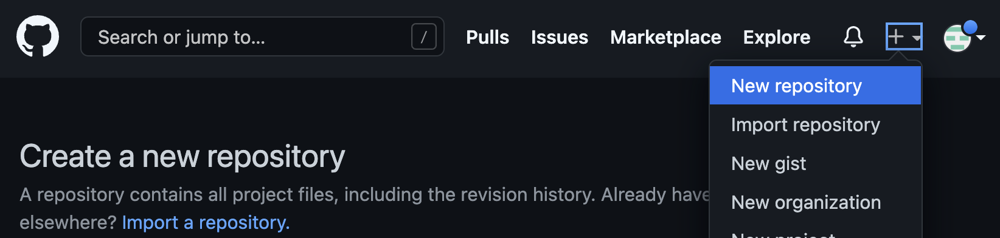
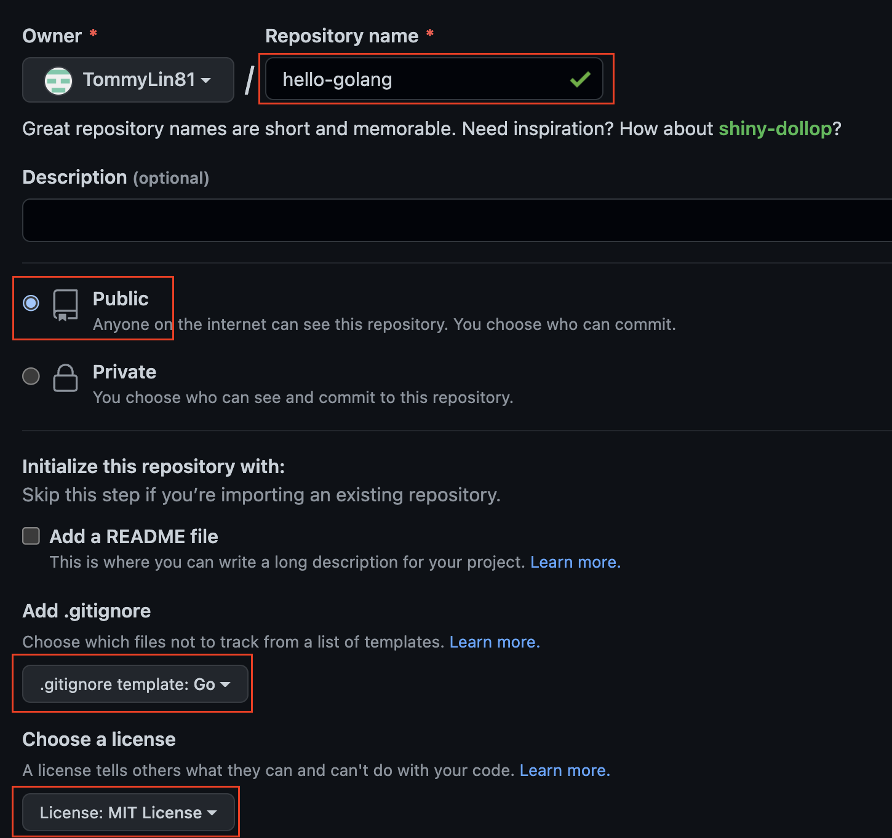

# Cashier

## Overview
[TOC]

## Description

Practice to publish this golang module

## Publishing steps

### go to [github](https://github.com/new) and create new repository



### setting repository config

repository link = https://github.com/TommyLin81/hello-golang

use MIT license



### clone to local project

```shell
$ cd ~/workspace

$ git clone https://github.com/TommyLin81/hello-golang.git

$ cd hello-golang
```

### create golang module

```shell
$ go mod init github.com/TommyLin81/hello-golang
go: creating new go.mod: module github.com/TommyLin81/hello-golang

$ touch hellogolang.go

$ touch hellogolang_test.go
```

in `~/workspace/hello-golang/hellogolang.go`

```golang
package hellogolang

func Hello() string {
    return "hello golang !"
}
```
in `~/workspace/hello-golang/hellogolang_test.go`

```golang
package hellogolang

import "testing"

func TestHello(t *testing.T) {
    result := Hello()
    if result != "hello golang !" {
    	t.Fatal("Hello function return Fail")
    }
}
```

run golang unit test

```shell
$ go test
PASS
ok      github.com/TommyLin81/hello-golang      0.319s
```

### push module and setting release version

```shell
$ git add .

$ git commit -m 'feat: add Hello function'

$ git tag v0.1.0

$ git push origin v0.1.0
```